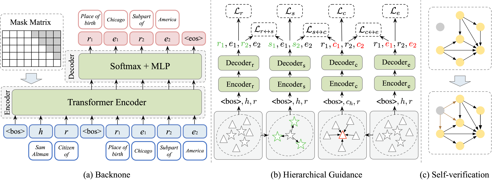

## Cold-start Multi-hop Reasoning by Hierarchical Guidance and Self-verification

This is the PyTorch implementation of of the **SelfHier** model for multi-hop reasoning.

## Overview
We present **SelfHier**, which utilizes the **Self**-verification and **Hier**archical Guidance to conduct multi-hop reasoning. Here is an overview of our model architecture:



## Training SelfHier
To reproduce our results or extend SelfHier model to more datasets, we provide a detailed description as follow:

1、Go `data/` folder, generate mapping files by running:
```
python utils.py --dataset NELL23K --gen-mapping --gen-eval-data
```

2、Then, our model utilizes [AnyBURL](https://web.informatik.uni-mannheim.de/AnyBURL/) to mine logical rules. 

We provide a convenient script `run.sh` under `AnyBURL/` for mining and filtering high confidence rules (please modify the dataset name in `run.sh` and `config-learn.properties`). The above step helps generate `rule.dict` containing high quality rules under the dataset folder, then go to `data/` folder and run:
```
python utils.py --dataset NELL23K --gen-train-data --num 6 --out 6_rev_rule --max-len 3 --rule
```

3、Go `data/NELL23K/` folder, generate the type_constrain.txt
```
python n-n.py
```
4、Go `OpenKE-OpenKE-PyTorch/openke` folder
```
bash make.sh
```
5、Go `OpenKE-OpenKE-PyTorch` folder, training embedding
```
python train_transe_NELL23K.py
```
6、Go `SelfHier-main/` folder
```
python process_hierarchical_guidance.py --datapath 'data/NELL23K/'
```
7、Train SlefHier
```
python train.py --dataset NELL23K --batch-size 1024 --lr 5e-4 --dropout 0.1 --eval-begin 50 --num-epoch 50 --save-interval 50 --save-dir "model_NELL23K" --label-smooth 0.25 --trainset "6_rev_rule" --prob 0.15 --beam-size 512 --test-batch-size 4
```

**Other training Setting**
```
python train.py --dataset NELL995 --batch-size 512 --lr 1e-3 --dropout 0.1 --eval-begin 25 --num-epoch 25 --save-interval 25 --save-dir "model_NELL995" --label-smooth 0.25 --trainset "6_rev_rule" --prob 0.15 --beam-size 512 --test-batch-size 2 --warmup 10
python train.py --dataset FB15K237 --batch-size 1024 --lr 5e-4 --dropout 0.1 --eval-begin 50 --num-epoch 50 --save-interval 50 --save-dir "model_FB15K237" --label-smooth 0.25 --trainset "6_rev_rule" --prob 0.15 --beam-size 512 --test-batch-size 8 --warmup 3
python train.py --dataset FB15K237-20 --batch-size 1024 --lr 1e-4 --dropout 0.1 --eval-begin 15 --num-epoch 15 --save-interval 15 --save-dir "model_FB15K237-20" --label-smooth 0.25 --trainset "6_rev_rule" --prob 0.25 --beam-size 512 --test-batch-size 4
python train.py --dataset NELL23K-40 --batch-size 1024 --lr 5e-4 --dropout 0.1 --eval-begin 5 --num-epoch 5 --save-interval 5 --save-dir "model_NELL23K-40" --label-smooth 0.25 --trainset "6_rev_rule" --prob 0.15 --beam-size 512 --test-batch-size 4
python train.py --dataset NELL23K-50 --batch-size 1024 --lr 5e-4 --dropout 0.1 --eval-begin 5 --num-epoch 5 --save-interval 5 --save-dir "model_NELL23K-50" --label-smooth 0.25 --trainset "6_rev_rule" --prob 0.15 --beam-size 512 --test-batch-size 4
python train.py --dataset NELL23K-60 --batch-size 1024 --lr 5e-4 --dropout 0.1 --eval-begin 5 --num-epoch 5 --save-interval 5 --save-dir "model_NELL23K-60" --label-smooth 0.25 --trainset "6_rev_rule" --prob 0.15 --beam-size 512 --test-batch-size 4
python train.py --dataset FB15K23720-10 --batch-size 1024 --lr 1e-4 --dropout 0.1 --eval-begin 10 --num-epoch 10 --save-interval 10 --save-dir "model_FB15K23720-10" --label-smooth 0.25 --trainset "6_rev_rule" --prob 0.25 --beam-size 512 --test-batch-size 4
python train.py --dataset FB15K23720-20 --batch-size 1024 --lr 1e-4 --dropout 0.1 --eval-begin 10 --num-epoch 10 --save-interval 10 --save-dir "model_FB15K23720-20" --label-smooth 0.25 --trainset "6_rev_rule" --prob 0.25 --beam-size 512 --test-batch-size 4
python train.py --dataset FB15K23720-50 --batch-size 1024 --lr 1e-4 --dropout 0.1 --eval-begin 10 --num-epoch 10 --save-interval 10 --save-dir "model_FB15K23720-50" --label-smooth 0.25 --trainset "6_rev_rule" --prob 0.25 --beam-size 512 --test-batch-size 4
```

Note that the train.txt in each dataset is pre-complete by Self-verification on raw data train_raw.txt.

If you want to leveraging the Self-verification to pre-complete the data by yourself, rmoving the train.txt and renameing the train_raw.txt to train.txt.
Then, runing the STEP1 to STEP6 and:
```
python train.py --dataset NELL23K --eval-pattern 1 --batch-size 1024 --lr 5e-4 --dropout 0.1 --eval-begin 50 --num-epoch 50 --save-interval 50 --save-dir "model_NELL23K" --label-smooth 0.25 --trainset "6_rev_rule" --prob 0.15 --beam-size 512 --test-batch-size 4
```
After getting the new_dict.json, run:
```
python process_self_verification.py --datapath 'data/NELL23K'
```
Rename the train_new.txt to train.txt and run the STEP1 to STEP7 again.